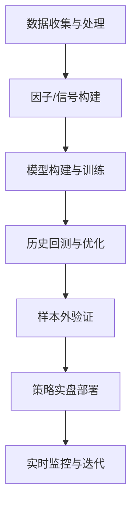

# 执行摘要  
建立和运营一个可盈利的量化策略基金，需要从策略设计、研究开发、交易执行、风控管理、运营合规、组织建设到技术架构等多方面系统布局。首先要明确基金定位：选择合适的策略类型（如高频、日内、中低频、趋势跟踪、套利、统计套利或机器学习驱动等）、目标市场（股票、期货、外汇、衍生品等）、投资频率和周期，以及预期收益/风险目标和规模上限。接着进行**策略研发**：保证高质量的数据源，多因子/信号构建和模型验证，注意防范过度拟合和充分进行样本外测试【62†L58-L62】【58†L143-L149】。在**交易执行**端，要准确构建交易成本模型和滑点测算，采用最优执行算法（如VWAP、TWAP、Iceberg等）和健壮的交易基础设施，选择合规可靠的经纪商或做市商。**风控和资金管理**要制定严格的风险限额和头寸规模规则，控制杠杆比率，设计止损/止盈机制，定期做压力测试和风险归因分析，确保在极端行情下可控。运营合规方面，各地区对量化交易有不同要求：在中国需登记基金管理人牌照并执行最新的程序化交易报告制度（策略备案、申报速率上限等）【46†L65-L68】【69†L1-L4】；港美、新加坡亦需相应牌照和监管申报。团队建设需涵盖策略研究、数据开发、交易运维、风控合规等关键岗位，并设计合理的激励机制。成本与盈利模型则需综合考虑管理费（一般1–2%）和业绩费（常见20%）结构【75†L180-L183】，以及固定成本（技术、人力、场地等）和规模扩大带来的边际效应（规模过大可能导致收益下滑【78†L1-L4】）。募集与投资者关系要选择多元化渠道（机构投资者、FOF、直销平台等），准备专业的路演材料和业绩演示（图表化的净值曲线、风险指标等），严格披露合规信息。技术基础设施方面需要建设高效的数据平台（包括历史行情、财务等多源数据）、完善的回测和实盘交易系统，以及实时监控告警、备份灾备体系。最后，通过学习国内外成功与失败案例（如Medallion基金年化近80%【88†L1-L4】 vs LTCM因过度杠杆崩盘【83†L1-L8】）来优化策略与风控。总体而言，建议先短期聚焦策略验证与合规搭建，中期完善执行和风控体系、开展募资，长期扩展策略品类和国际业务。以下章节将分维度详细阐述关键要点、常见风险、关键指标与KPI，以及推荐工具/资源，最后提出分步实施路线图及优先级。

## 基金定位与策略选择  
- **策略类型**：选择合适的投资策略类型，如高频交易（HFT）、日内交易、中低频量化、趋势跟踪（CTA）、套利（跨市场、跨品种）或机器学习驱动的策略。高频策略每天交易频繁、对微观价格变化敏感，净值曲线平滑但容量有限【52†L65-L68】【45†L60-L62】；中低频（如1天以上持仓）换手率低，对模型稳定性要求高、规模容量更大【52†L65-L68】。趋势策略依赖趋势持续性，可适用较大规模，成本较低；统计套利策略收益来自小的价差，需要快速交易及强大算力；机器学习策略视数据与模型能力，往往对技术和数据要求更高。  
- **市场与品种**：根据策略特点选择市场，如A股、港股、美股、期货、外汇、数字资产等。不同市场流动性、交易规则、交易成本和时区不同，需要分别评估。例如，中国A股对大规模高频策略有限制（监管对每秒/每日申报笔数限额）【46†L65-L68】【45†L60-L62】；期货市场较利于趋势和套利。  
- **投资频率与期限**：明确持仓周期（日内、周频、月频等）和投资期限，影响所需的基础设施、数据频率（Tick级、分钟、日K等）和风险控制方式。  
- **收益/风险目标**：设定绝对收益还是相对收益目标，预期年化收益率、风险调整后收益（如Sharpe、信息比等）和最大回撤目标。比如追求较高收益的策略可接受较大波动；要求稳健则目标年化10–15%，最大回撤<10%。常用KPI包括年化收益率、年化波动率、最大回撤、夏普率、Calmar比、卡玛比等【58†L149-L158】【58†L143-L149】。  
- **规模上限**：不同策略对资金规模的敏感度不同。一般而言，规模越大往往收益率难以维持【78†L1-L4】。如统计套利和日内策略对流动性要求高，规模过大时难以成交；趋势策略由于分散多品种，可容纳更大规模。通常给出小型(<100M)、中型(100M–1B)、大型(>1B)的运营建议：小型基金可策略敏捷、允许高风险探索；中型可规模化多个策略；大型需严格分散、偏重低频策略以免流动性问题。  
- **常见风险**：策略选择不当或过度集中于热门因子会导致回撤。例如市场结构变化使趋势策略失效，或策略风格高度集中导致风格漂移。高频策略需警惕监管风险（新规对秒级申报频率限定等【45†L60-L62】【46†L65-L68】）和市场流动性风险；低频策略需防范宏观逆转风险。  
- **可量化指标/KPI**：不同策略类型可跟踪的指标包括：年化收益率、夏普率、最大回撤、Calmar比/卡玛比【58†L149-L158】、命中率、盈亏比、换手率、流动性指标等。  
- **推荐工具/平台**：选择成熟平台支持策略模拟和交易，如米筐、BigQuant、聚宽等国产平台（适合因子研究和回测）；国际可用QuantConnect (Lean)、Backtrader、Zipline等框架。数据方面可用Wind、同花顺、聚源等中文数据源，或Bloomberg/Refinitiv、雅虎财经等。策略构建可用Python生态（Pandas、scikit-learn、XGBoost），或Matlab/R。  

*策略类型差异比较表（示例）*：以下表格概述了各策略类型在收益、成本、规模、技术要求及监管方面的典型特征。

| 策略类型        | 收益特点                       | 交易成本       | 规模限制         | 技术要求            | 监管影响                      |
|:-------------|:---------------------------|:-----------|:-------------|:----------------|:-------------------------|
| 高频交易 (HFT)    | 平均每笔收益小，追求总量（年化可高）；曲线平滑【52†L65-L68】 | 交易成本最高（手续费、通道费）；需求低延迟 | 容量非常有限（易受流动性制约）；规模扩大时滑点增大 | 极高（低延迟系统、 colocate、专用硬件） | 高；交易所/监管严格限制订单频率、异动需上报【45†L60-L62】【46†L65-L68】 |
| 日内/当日策略    | 收益中等偏高；对日内走势敏感      | 较高（频繁交易产生滑点） | 中等；受次级流动性影响    | 高（快速决策支持、实时数据） | 中等；需报备算法、符合券商准入  |
| 中低频策略      | 收益稳定、波动适中               | 交易成本较低      | 可较大规模（持仓期长、逐步建仓）  | 中等（批量数据处理、信号更新周期） | 较低；频次低，风险主要是策略回撤风险 |
| 趋势跟踪/CTA策略 | 收益随趋势强度波动；市场好时收益高 | 交易成本较低      | 最大（可覆盖全球市场多品种分散）  | 中等（多品种同步监控、模型复杂度） | 低；通常视为普通对冲基金，合规以基金管理为主 |
| 套利策略        | 单次收益小但确定性高；市场中性    | 中等（需同时做多空，双边成本） | 中等；受市场深度影响      | 高（需快速捕捉并对冲价差）   | 中等；部分套利（如期现套利）可能受交易规则限制 |
| 统计套利 (配对)  | 收益稳定，但可行性逐渐下降       | 中等至高（常有大量交易） | 中等；策略饱和度高，规模扩张易降低效果 | 中高（需复杂统计分析和配对算法） | 低；与趋势跟踪类似，主要关注风险敞口 |
| 机器学习驱动    | 不确定性大，潜在收益高（+/-）     | 视交易频率而定      | 视模型可解释性和市场接受度而定 | 极高（海量数据、GPU/分布式运算） | 中等；关注数据合规和模型使用说明 |

以上表中各点仅供参考，实际效果因策略具体设计和市场环境差异而异【52†L65-L68】【75†L180-L183】。

## 研究与策略开发  
- **数据来源与质量**：策略研发的基础是多样化的高质量数据，包括行情（Tick、分钟、日线）、财务财报、宏观指标、新闻舆情、社交媒体、卫星遥感等另类数据。中国常用Wind、同花顺、聚源数据库；海外可用Refinitiv、Bloomberg、Kaggle等。保证数据完整性和准确性非常关键，要进行缺失值填补、清洗（去除异常点、复权等）和校验。强调数据溯源：华宝基金多因子模型就高度重视**数据源质量控制**【58†L143-L149】，避免因数据错误导致模型失效。  
- **因子/信号构建**：采用价值、质量、成长、情绪、技术、资金流等经典因子构建多因子模型【58†L143-L149】。例如，华宝量化对冲基金的Alpha多因子选股模型使用了价值、质量、成长、情绪、技术、资金流等因子【58†L143-L149】，并结合风险评分和行业配置模型。开发因子时可用阈值法、排序法、回归模型等方法【57†L0-L5】，也可用机器学习方法（随机森林、XGBoost、深度学习）来预测收益或分类信号。  
- **模型类型**：根据策略需要选择模型，如均值回归、动量策略模型、贝叶斯模型、支持向量机、神经网络等。近年来机器学习/深度学习方法在量化中应用广泛，但需特别防范过拟合。任何模型都应有明确的经济/金融动机，避免纯数据驱动结果离散。  
- **回测框架**：搭建完善的历史回测框架，包括分级样本切分（训练集、验证集、测试集）和可靠的佣金滑点模拟。遵循“闭环”测试原则：训练集和测试集划分后固定，避免不断优化测试集造假【62†L58-L62】。完整回测流程应包括成交仿真、持仓估值（可考虑逐日标记市值）、日终对账等，确保回测结果可重现。可以使用Backtrader、Zipline、QuantLib、天勤（TQSDK）等工具，也可自建系统。  
- **过拟合防范**：过度优化（“曲线拟合”）会导致策略样本外表现差【62†L58-L62】【60†L41-L44】。必须通过交叉验证、滚动窗口验证和控制模型复杂度等手段检测过拟合。例如常用的对比训练集与测试集的IC平均值和方向一致性【60†L41-L44】【62†L58-L62】。BigQuant建议**训练/测试集 IC 曲线方向一致**作为健康模型指标【62†L77-L81】【62†L143-L149】。  
- **样本外验证**：将策略应用于完全独立的时间段或市场（不同市场或不同品种）进行检验。如果策略在不同市场均有效，则可进一步提升置信度。必要时还可进行实时纸面交易测试。应记录样本外的各项风险收益指标，确保其符合预期。  
- **关键指标/KPI**：检测策略的主要指标包括：**回测年化收益、年化波动率、Sharpe/Sortino、最大回撤、Calmar比/卡玛比、胜率、盈亏比、IC均值/IR、因子有效天数**等【58†L149-L158】。同时跟踪**下行风险度量**如潜在最大损失（PSL）、尾部风险。因子策略可关注IC、因子稳定性和信息比率。  
- **推荐工具/资源**：策略研究推荐使用Python（Pandas、NumPy、scikit-learn、TensorFlow/PyTorch）或R语言，并结合专业量化平台。中文资源有《量化投资策略》教材、证监会和基金业协会发布的量化交易规则，《金融市场风险管理》等书籍。行业报告如银河证券、申万宏源等对量化公募基金的研究也可参考。保证引用原始资料或行业白皮书为佳。



## 交易与执行  
- **交易成本模型与滑点**：准确估计交易成本是成功的重要前提。构建成本模型需考虑：固定费用（佣金、印花税）、价差成本（买卖价差）、冲击成本（成交量对价格的影响）、券商费用等。使用**回归模型**或模拟来预测滑点，输入参数包括预期成交量占市场成交比例、当日波动率等。也可采用已发表的如Almgren-Chriss模型来模拟冲击成本。实时监控成交均价与预估成本的差异，作为KPI跟踪。  
- **最优执行算法**：根据策略特点选择执行方式。常用算法有：VWAP/TWAP（保证均匀成交）、POV（按百分比下单）、冰山、时间加权VWAP、实盘套利流水等。对于高频策略可能需要自研低延迟算法；中低频策略则可采用常规算法交易接口。执行过程中应并行考虑风险控制，如设置序贯限价单、熔断机制（超过某损失立即停止）。  
- **交易基础设施**：搭建低延迟、高可靠的交易系统，包括市场数据网关、信号处理引擎、订单管理系统（OMS）和风险管理终端。高频策略可能要求在交易所或券商服务器旁（colocation）部署节点。对于境外交易，还需处理时差、汇率、税费结算等问题。监控系统应时刻检查断线、下单失败、异常回撤等，并及时报警。  
- **经纪/交易对手选择**：选择信誉良好、执行效率高的券商和做市商。国内个人量化可通过支持算法交易的券商（华泰、新湖、国金等）的客户端或QMT软件下单。机构投资者可考量证金公司协议、券商极速柜台（如恒生速报），以及跨境交易平台。需尽量分散交易对手风险，并评估对手方（counterparty）信用等级。  
- **可量化指标/KPI**：如“实现成本”（Implementation Shortfall）、滑点率、成交率、订单埋单时间、成交分布图、交易主动/被动执行比例、成交延迟等。对比不同算法的效果，并持续优化。  
- **常见风险**：执行延迟或软件故障（参见Knight闪崩【83†L7-L10】教训）；过度交易导致流动性枯竭；券商流失。规避方法包括：充分模拟、采用成熟的软件/硬件、设置风控断路器，以及对执行过程日志全面记录。  

```mermaid
flowchart LR
    策略信号 --> 成本分析[交易成本分析]
    成本分析 --> 下单[订单管理系统(OMS)]
    下单 --> 券商[券商/做市商]
    券商 --> 市场[交易所/撮合引擎]
    市场 --> 确认[成交确认&结算]
    确认 --> 风控[实时风控监控]
```

## 风险管理与资金管理  
- **风险限额**：对整体组合和单个策略设置风险限额，包括每日最大损失限额、VaR限额、单品种或行业头寸限额等。运用风险模型（如Factor VaR、历史模拟VaR）实时监测风险指标。一旦接近限额，应自动触发报警或减少敞口。【80†L49-L52】案例警示：过度杠杆和仓位失控会导致巨大损失；需设限杠杆倍数和集中度。  
- **头寸规模**：采用基于风险的头寸控制方法，如**波动率调仓**或**凯利公式**等。根据策略风险（如预期波动率、最大回撤）动态调整单笔和多头/空头规模。确保在极端行情下，单日波动不会使组合爆仓。  
- **杠杆管理**：根据策略信号和风控要求设定适度杠杆。应严格监控实际杠杆率（等效Beta或Notional/Gross Exposure），并与预设阈值比较。对高杠杆策略尤其慎重，如LTCM案例【80†L49-L52】警示，杠杆放大会同时放大风险。  
- **止损/止盈机制**：在系统层面设计自动化的止损和止盈策略。可以是固定比例止损，也可基于VaR超限自动平仓。对热门高频策略，可设置秒级监测，一旦浮亏超过阈值（如1%）即时减少头寸或停单。对于中低频策略，可在日终或周末进行风险敞口检查。  
- **压力测试**：定期进行极端情景模拟，如市场剧烈下跌、流动性骤降、利率骤变等情形下的组合表现。参考过去历史危机（2008危机、2015年A股波动等）重新测试策略。压力测试结果作为风险容忍度参考，可用来检验风险限额设定是否合理。  
- **风险归因与监控**：对已实现的收益与风险进行归因分析，例如按因子（Beta、特质风险）、行业、区域划分的风格暴露。建立实时风险仪表盘，监控主要风险敞口（市场风险、对手风险、流动性风险、模型风险）。常用风险指标包括：日VaR/ES、累积回撤、收益波动率、Alpha暴露等。  
- **推荐工具/资源**：风险系统可以参考Wind量化风险平台、Axioma/Barra风险模型、FactSet风险工具等。投资组合管理可用RiverFront、Bloomberg PORT等。国内私募可关注中基协最新风险管理指引。  
- **常见风险**：流动性风险（市场断档时无法成交）、对冲对手风险、量化策略相关性上升（同质化风险）【83†L12-L17】。历史经验表明，大范围的相关性崩盘会同时击垮多家策略【83†L12-L17】；因此风险管理需关注**尾部相关性**和**全局系统性风险**。  

【90†embed_image】 *图：常用的风险矩阵示例（以概率×损失严重度分类风险等级），用于定性风险评估和限额设置。风险管理应重点控制红色高风险区域的敞口。*

## 运营与合规  
- **公司架构**：可设立一般合伙企业（GP）+有限合伙（LP）模式的基金管理架构。中国国内运行需注册私募基金管理人并接受中基协管理（要求注册资本≥1000万，三名高管持有证券从业资格等）【46†L55-L62】。不同业务模式（如自营、资管、QFII等）对应不同牌照。境外机构一般在香港、新加坡或美国设立基金子公司或合伙企业，持相应牌照（SFC、MAS、SEC等）。  
- **合规监管**：遵守当地监管要求。中国近期对程序化交易出台《实施细则》，要求量化基金向券商/交易所报备策略类型、服务器位置、申报频率等【46†L65-L68】【69†L1-L4】。合规团队需跟进监管动态，如沪深交易所的新规对**高频申报速率**、算法报告和融券T+0套利的限制【46†L65-L68】。香港、新加坡、美国等则有各自的基金监管规则（如香港SFC监管AUM、风险披露；美国SEC要求登记为投资顾问、递交Form PF等）。  
- **审计与估值**：建立独立托管和估值体系。基金净值计算应每日（或每日多次）完成，并由合格的托管银行或第三方进行净值核算。年度需委托律师或会计师对运营进行审计。要确保估值方法符合《私募基金募集行为管理办法》等法律规定，尤其对衍生品和另类资产的估值应披露方法。  
- **KYC/AML合规**：对投资者实施“了解客户”程序，确保只接受符合条件的合格投资者，并防范洗钱风险。建立客户身份识别、交易监控和可疑交易报告流程，符合反洗钱法规。  
- **资金管理与清算**：资金帐户应与团队运营帐户严格分离，由独立托管方负责。交易清算风险需与经纪商签订清算协议，并预留足够保证金。监控资金流向和回款情况，防止挪用。  
- **可量化指标/KPI**：合规方面的KPI包括：报告提交及时率、审计合规发现率、估值差错次数、投资者合格度检查覆盖率等。  
- **推荐工具/资源**：关注**中国证监会**、**中基协**官网发布的最新指引，如2025年《程序化交易管理规定》及交易所实施细则【45†L55-L63】【46†L65-L68】。香港可参考SFC《基石指引》，新加坡可参考MAS的《投资基金管理规范》。合规系统可借助外部服务，如合规报告软件、电子签名与投资者身份验证平台。

## 团队与组织  
- **关键岗位与技能**：常见核心岗位包括：基金经理（PM，负责最终决策）、量化研究员（构建模型、分析策略）、量化开发/工程师（搭建系统、回测框架）、数据工程师（数据采集清洗）、交易员/操盘手（实盘执行）、风险管理专员（监控风险、合规）、技术支持（运维、网络安全）、投资者关系/合规专员、CFO/财务。技能方面需有金融/数学/计算机交叉人才，熟练使用编程语言（Python/C++/Java）、数据库、机器学习和统计知识。  
- **招聘与激励**：寻觅具有顶尖学历或经验的人才，同时注重训练具有实际经验的交易团队。常用招聘渠道有行业校招、量化竞赛（Kaggle风格）、猎头服务等。团队激励可采用**固定+绩效**模式，对于基金经理和核心研究人员可增设“业绩分红/股权”方案（例如业绩挂钩分成、基金合伙份额）。管理团队应对冲浪心态进行文化控制，强调纪律和风控。  
- **组织结构**：建议设置扁平化协作模式，研究、交易、风控各部门相互独立但紧密沟通。建立例会和报告制度，实时分享交易信号、市场观点和风险情况。  
- **外包与合作**：对于非核心职能可考虑外包，如部分IT基础设施、非关键运营服务、会计审计等。也可与高校、研究机构合作获取新算法；与券商、数据商合作获取量化工具支持。  
- **常见风险**：人力流失风险（对冲基金普遍竞争激烈）、道德风险（个人账户与基金账户混用）、团队分工不清导致效率低下。应制定内部控制制度（如交易员独立风控、禁止关键员工竞业等）。  
- **可量化指标/KPI**：团队执行力可衡量：策略研发进度、系统上线时间、Bug率、交易符合率（信号触发到执行的成功率）、人员留存率、投入产出比（人力成本/策略收益）。

## 成本与盈利模型  
- **费用结构**：通常包括固定管理费（1–2%/年管理费）和业绩报酬（如20%绩效费）【75†L180-L183】。此外，对外募资的销售费或托管费（如信托模式时的中介费）也需考虑。在国内，程序化交易还可能产生较高的通道费（高频费率）【45†L60-L62】【46†L65-L68】。  
- **固定成本**：主要包括人员薪酬、研发和IT投入（服务器、软件许可）、办公租金、数据订阅费、合规审计费等。这些成本相对固定，与管理规模无关。初创团队建议估算好两年左右的燃烧率。  
- **收益分成与效率**：私募FOF结构（如上表所示【75†L188-L192】）会叠加多层费用，应尽量避免复杂中间结构。净收益最终属于管理人和投资者，对比营收（管理费+业绩费）与成本后才为净利。**重要指标**包括盈亏平衡点（需达到的规模+收益率），管理费收入 vs 固定支出比率。  
- **规模与边际收益**：基金规模扩大后可能面临**边际收益递减**，即同样的策略对更大资金池往往需要降低仓位、增加滑点，导致单位资金收益下降【78†L1-L4】。因此须在策略开发时评估容量（容量测试）并在产品说明中披露规模上限。小规模时，策略可更加激进；大规模时可能需要增加低频/宽基策略以消化规模。  
- **常见风险**：高收费+低透明度会削减投资者信心【73†L109-L117】【75†L180-L183】。如WallStreet见闻报道，投资者往往忽视扣费后的真实收益【73†L109-L117】。需透明展示费率结构和历史净收益。  
- **推荐工具/资源**：搭建财务模型或商业计划表，计算不同规模/费率下净收益。参考国内外量化基金的商业模式公开资料，如Citadel、Millennium等巨头已不再单纯依赖管理费【72†L0-L3】。国内可关注券商研究或第三方报告（如私募排排网）了解行业收费水平。

## 募集与投资者关系  
- **募资渠道**：可通过高净值客户、家族办公室、FOF/FOHF产品、银行理财通道、财富管理平台等多渠道募集资金。国内可结合资管新规允许的方式（如股权投资）、合格投资者私募销售；海外可考虑机构直投、家族基金。  
- **路演材料与业绩展示**：准备专业的产品募集文件，包括详细的策略介绍、业绩回顾图表（净值曲线、回撤曲线、月度收益分布图、风险指标表等）、风险揭示及合规条款。使用直观图表（如示例累计净值增长曲线和最大回撤图）帮助投资者理解。按照监管要求披露历史业绩和标杆表现，切忌夸大回报。定期发布月报/季报，展示风险收益情况并解释策略变化。  
- **合规披露**：严格按照监管要求披露相关信息。在中国，私募需提交“月度运行报告”给销售渠道，披露投资组合、风险限额、运营情况等。对外沟通要有风控提示和合适性警告，尤其强调回撤风险。若向海外投资者募集，还需遵守当地法律（如美国的投资者合格性、澳洲AUS60限制等）。  
- **投资者关系**：保持与投资者的沟通与教育，及时回应投资者疑问。建立良好信任关系，公示业绩数据并说明市场环境和策略调整的原因。关注投资者满意度（通过续投率、推荐度等指标），并利用第三方评级机构（如晨星、EQS）报告提升信誉。  
- **常见风险**：募资速度过快可能超出策略承载能力；募资目标与策略风控不匹配（例如许诺指数大幅跑赢却持有高风险策略）。解决方法是坚持公布真实数据，逐步扩张，不违背适当性原则。

## 技术与基础设施  
- **数据平台**：建设高性能的数据存储与处理平台，包括历史行情数据库、因子和财务数据库。可采用开源库（如MySQL/Postgres + KDB+）或云服务（AWS/Azure）。注意数据备份和多源验证（交叉比对Wind与同花顺等数据）。  
- **回测/实盘系统**：回测系统需支持海量历史数据快速回测，并能准确模拟交易成本。实盘系统需能无缝接收策略信号并生成交易指令，对接券商API或交易所网关。建议主数据和行情通过内存计算（Redis、ClickHouse等），实盘下单可用FIX协议。  
- **监控与报警**：建立实时监控仪表盘，监测行情行情、策略指标、系统状态。关键指标如成交延迟、资金余额、异常交易信号、策略回撤等出现阈值时发出报警（短信、邮件）。使用Prometheus+Grafana等开源工具部署监控。  
- **备份与灾备**：确保关键系统冗余：数据定期备份，关键系统（如OMS、数据库、网络节点）双活部署。制定灾难恢复计划（断电、主机故障或网络异常时），并定期演练。  
- **可量化指标/KPI**：系统可用性（Uptime）、订单成功率、数据延迟、平均延迟、报警响应时间等。技术团队应定期复盘重大技术故障（如2012年Knight闪崩【83†L7-L10】强调的技术部署错误教训）。  
- **推荐平台/资源**：可采用企业级硬件或者云计算资源（AWS EC2/GCP Compute）支撑弹性需求。使用Docker/Kubernetes等容器化技术提高运维效率。开源量化平台可参考QuantStack、Lean/QuantConnect。  

## 案例与经验教训  
- **成功案例**：Renaissance Technologies的Medallion基金长期业绩卓越，据报道年化收益接近80%【88†L1-L4】，得益于极其严密的数据挖掘和成本管理。桥水基金（Bridgewater）凭借风险平价和全天候等多策略混合在不同市场环境下保持稳定回报。阿尔法（AQR）等机构强调因子多元化和风险平衡，也取得长期正收益。  
- **失败案例**：LTCM (1998) 曾年化超40%，但因**过度杠杆**、模型过度自信和流动性崩溃，在4个月内损失46亿美元【83†L1-L4】；Knight Capital (2012) 技术部署失误，在45分钟内亏损4.4亿美元【83†L7-L10】；2007年8月，美国多家量化基金因过度集中在相同策略（如量化趋势）同时亏损数十亿美元【83†L12-L17】。这些案例的共同教训是：**风险控制首位**——充足预案、谨慎杠杆、完善监控和断路机制不可或缺。  
- **中国经验**：国内百亿级私募普遍采用多策略配置，有机构指出随着规模增长，中低频策略的比重需提高【45†L74-L83】；此外最新程序化交易细则强调合规透明，促使机构关注策略质量胜过单纯追求速度【45†L64-L71】【46†L65-L68】。基金经理长期实战经验也被证明对穿越牛熊非常重要【58†L143-L149】【80†L49-L52】。  
- **常见陷阱**：主要包括数据错误（脏数据）、过度拟合、忽视交易成本、风险对冲不足、团队沟通不畅等。参考国内外失败案例，经常复盘“回测再美丽，实盘亏成样”之警言【62†L58-L62】【83†L1-L10】，避免重蹈覆辙。

## 实施路线图与优先级  

### 短期（0–6个月）  
- **策略验证**：使用历史数据快速验证核心策略是否有效，完成初步回测分析。设置基础风险/资金管理规则。  
- **基础架构**：搭建数据存储与回测环境，部署关键的软件系统（回测平台、交易系统原型）。选定核心技术栈。  
- **牌照合规**：在目标市场完成必须的注册登记。国内需尽快成立基金公司、申请私募管理人资格【46†L55-L63】；同时建立合规团队，准备程序化交易报备（如策略备案）。  
- **团队组建**：招聘关键岗位，如高级策略研究员、量化开发、风险经理和合规人员。设定岗位职责和初步激励方案。  
- **组织规划**：明确策略优先级和资源分配，制定详细的项目计划和KPI。  
- **募资准备**：开始撰写募集材料、模拟路演，建立初步的投资者网络。  

### 中期（6–18个月）  
- **策略迭代**：在小规模实盘或模拟盘下测试策略，持续优化模型和参数。引入更多策略组合，以降低单策略风险。  
- **交易系统完善**：升级交易基础设施，实现与实际券商/交易所的实时连接。完成订单管理系统及实时监控平台的开发。  
- **风控升级**：建立完善的风险管理流程，包括VaR和压力测试流程。定期进行历史极端行情回测。  
- **募资与市场推广**：正式推出基金产品，面向目标投资者群体进行路演。根据合规要求发布业绩公告。  
- **组织优化**：根据业务进展调整组织结构和分工，加强内部培训与沟通。设置定期业绩和风险报告制度。  

### 长期（18个月及以后）  
- **规模扩张**：在策略验证成熟后逐步扩大资本规模，同时关注策略容量极限。可能开拓新市场（境外投资）或新资产类别。  
- **多策略扩充**：研发更多不同逻辑策略（如增添机器学习策略、其他品种套利等），实现多元化投资组合。  
- **国际化布局**：根据计划，在新加坡、香港或美国注册相关资管公司，服务海外投资者，进行跨境投资。  
- **技术迭代**：持续优化技术堆栈，引入新技术（云计算、GPU计算等）以提升效率和容量。升级风险模型（如动态因子风险模型）。  
- **品牌建设**：参与行业研讨会、发表白皮书，提升团队和产品的专业形象，吸引更多合格资金。

**优先级清单（建议）**：合规与风控居首位，其次为核心策略研发与验证，然后是技术搭建与团队落实，最后是规模化募集与市场推广。在推进过程中，需要动态调整优先级：短期内必须保证策略合法合规运行，中期集中于实盘风控与资金安全，长期关注可持续性发展和规模管理。  

**重要参考来源**：证券时报、第一财经等行业报道及基金业协会资料【45†L64-L72】【46†L65-L68】【75†L180-L183】；国内外量化投资书籍与白皮书；基金经理访谈与案例研究等。以上分析兼顾理论与实践，以支持创始团队制定内部决策。